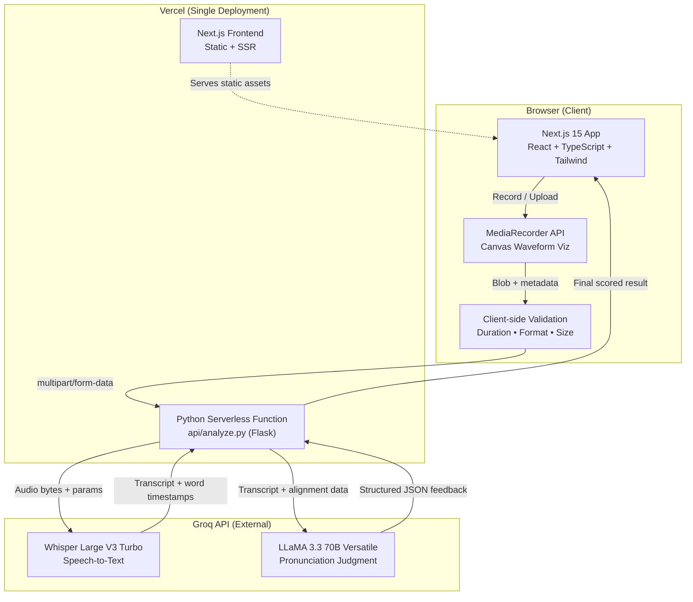

# Architecture Document — AI Pronunciation Coach

**Livo AI Technical Assessment**
**Author:** Nihal | **Date:** July 2026

---

## 1. System Architecture



### Request Flow

1. User records audio via MediaRecorder or uploads a file
2. Client validates: format (MP3/WAV/WebM/etc.), size (≤25MB), duration (30–45s)
3. Audio is POSTed as `multipart/form-data` to `/api/analyze` (Python serverless function)
4. Server pipeline:
   - Re-validates duration (from Groq response — authoritative check)
   - Transcribes via Groq Whisper → word-level timestamps
   - Aligns transcript to reference text via `jiwer` (scripted mode only)
   - Sends transcript + alignment data to Groq LLaMA for pronunciation judgment
   - Computes composite score from word accuracy + LLM fluency/clarity scores
5. Returns structured JSON to frontend for rendering

### Deployment

| Component | Platform | Runtime |
|-----------|----------|---------|
| Frontend | Vercel | Next.js 15 (Node.js) |
| Backend | Vercel | Python 3.12 Serverless (`@vercel/python`) |
| STT | Groq API | `whisper-large-v3-turbo` |
| LLM | Groq API | `llama-3.3-70b-versatile` |

**Why single-platform (Vercel)?** Eliminates CORS configuration, cold start issues (vs. Render free tier's 30–60s spin-up), and deployment complexity. The Python serverless function shares the same domain as the frontend, so API calls are same-origin.

---

## 2. Model & API Selection Rationale

### Why Groq over Azure/OpenAI/Google

| Criterion | Groq | Azure/OpenAI | Google Cloud STT |
|-----------|------|-------------|------------------|
| **Cost** | Free tier, no card required | Pay-per-use, card required | Pay-per-use, card required |
| **Rate limits** | Sufficient for demo scope | Higher, but paid | Higher, but paid |
| **Inference speed** | Extremely fast (LPU hardware) | Standard | Standard |
| **Whisper support** | Full model, word-level timestamps | Full | Different model |
| **LLM access** | LLaMA 3.3 70B included | GPT-4 (expensive) | Gemini (different API) |

**Key insight:** Composing STT + alignment + LLM ourselves (rather than wrapping a single vendor's black-box pronunciation scoring API) demonstrates AI pipeline engineering — understanding how to orchestrate multiple models, handle intermediate data, and build scoring heuristics.

### Why Whisper Large V3 Turbo

- OpenAI's state-of-the-art ASR model, hosted on Groq's fast inference
- Supports `verbose_json` response format with word-level timestamps
- English-optimized with low word error rate
- Turbo variant is faster with minimal quality tradeoff

### Why LLaMA 3.3 70B for Judgment

- Strong instruction-following for structured JSON output
- Capable of nuanced linguistic analysis (phoneme-level feedback)
- Available on Groq's free tier at 394 tokens/second
- `response_format: json_object` ensures parseable output

---

## 3. Scoring Algorithm

### Scripted Mode (Reference Text Available)

```
Final Score = (Word Accuracy × 0.60) + (Fluency × 0.25) + (Clarity × 0.15)
```

| Component | Source | Weight | Description |
|-----------|--------|--------|-------------|
| Word Accuracy | `jiwer` WER | 60% | `(1 - WER) × 100`. Measures how many reference words were correctly spoken |
| Fluency | LLM judgment | 25% | Smoothness, rhythm, natural pacing (0–100) |
| Clarity | LLM judgment | 15% | How clear and understandable (0–100) |

**Word alignment** uses `jiwer.process_words()` which implements the Levenshtein distance algorithm to classify each word as: hit (correct), substitution, deletion, or insertion.

### Free Speech Mode (No Reference)

```
Final Score = (Fluency × 0.60) + (Clarity × 0.40)
```

No word accuracy is available without a reference. The LLM analyzes the transcript for garbled words, unnatural patterns, and overall speech quality.

### What Determines a Highlight

| Status | Color | Trigger |
|--------|-------|---------|
| Correct | Default (white) | Word matches reference or sounds natural |
| Mispronounced | Rose/Red | Substitution in alignment; LLM confirms pronunciation error |
| Unclear | Amber/Yellow | Word appears garbled in transcript; LLM flags as mumbled |
| Missing | Gray + strikethrough | Reference word not spoken (deletion) |
| Extra | Blue | Word spoken but not in reference (insertion) |

---

## 4. DPDP Act 2023 Compliance

### 4.1 Data Collection

| Data Type | Collected? | Details |
|-----------|-----------|---------|
| Audio recording | Temporarily | Exists only in serverless function memory during processing |
| Transcript | Temporarily | Generated by Groq, used for analysis, not stored |
| Pronunciation score | Not stored | Returned to client only; server retains nothing |
| Personal identifiers | No | No login, no cookies, no user tracking beyond Vercel Analytics (anonymized) |

### 4.2 Data Processing

- Audio is received as a `multipart/form-data` upload into a Vercel serverless function
- Processing is entirely **in-memory** — no writes to disk or database
- The serverless function terminates after each response; all data is garbage-collected
- **No logs** contain audio content or full transcripts

### 4.3 Third-Party Data Processors

| Processor | Data Shared | Purpose | Retention |
|-----------|------------|---------|-----------|
| **Groq Inc.** (groq.com) | Audio bytes, transcript text | STT transcription and LLM analysis | Per Groq's privacy policy — API inputs are not used for training |
| **Vercel Inc.** | HTTP request metadata | Hosting and serverless function execution | Standard infrastructure logs |

No other third parties receive user data.

**Data Residency Note:** Under the DPDP Act 2023, cross-border data transfer requires explicit acknowledgment. Processing for this application currently occurs on Vercel's global edge network and Groq's US-based LPU infrastructure. We do not currently guarantee India-based data residency, meaning temporary processing happens outside India. Because no personal data or audio is stored post-processing, this exposure is limited to the transient request lifecycle.

### 4.4 User Consent

- A **consent checkbox** is presented before submission: *"I consent to processing my audio for pronunciation analysis."*
- An expandable **privacy details** section explains data handling in plain language
- Consent is required before the "Analyze" button is enabled
- No data is transmitted until consent is given

### 4.5 Right to Erasure

Since **no audio, transcripts, or personal data are retained** beyond the HTTP request lifecycle:
- The right to erasure is satisfied by design
- There is nothing to delete — the serverless function's memory is reclaimed immediately
- Users can be assured that their data does not persist in any form

---

## 5. Trade-offs and Future Improvements

### Trade-offs Made (Time-Constrained)

| Decision | Trade-off | Rationale |
|----------|-----------|-----------|
| Post-transcription duration validation | Wastes one API call if audio is wrong length | Avoids requiring `ffmpeg` binary on Vercel serverless |
| No phoneme-level analysis | Less granular feedback | `epitran` + `panphon` require `flite` system dependency unavailable on Vercel |
| LLM-based word classification | Non-deterministic | Faster to implement than building a custom phonetic distance model |
| Hardcoded reference sentences | Less flexible | More polished demo UX than free-text input |
| No user accounts or history | One-shot analysis only | Simplifies DPDP compliance and deployment |

### What I'd Build Next (With Another Week)

1. **Phoneme-level scoring** — Deploy `epitran` + `panphon` on a container-based backend (Railway/Render) to compute phonetic distance between expected and actual pronunciations, giving IPA-level feedback ("you said /θ/ but it sounded like /t/")

2. **Persistent history with DPDP-compliant storage** — User accounts (Clerk/Auth.js), encrypted score history in Supabase, explicit consent management, and a working deletion flow per DPDP Act requirements

3. **Multi-accent calibration** — Allow users to select their target accent (American, British, Australian) and adjust the LLM's judgment prompts accordingly

4. **Longer audio via chunked processing** — Support 2–5 minute recordings by splitting audio into 30s chunks, processing in parallel, and merging results

5. **Real-time streaming feedback** — Use Groq's streaming API for live transcription during recording, showing words as they're spoken

6. **Spaced repetition** — Track which phonemes/words a user struggles with and generate personalized practice sentences
